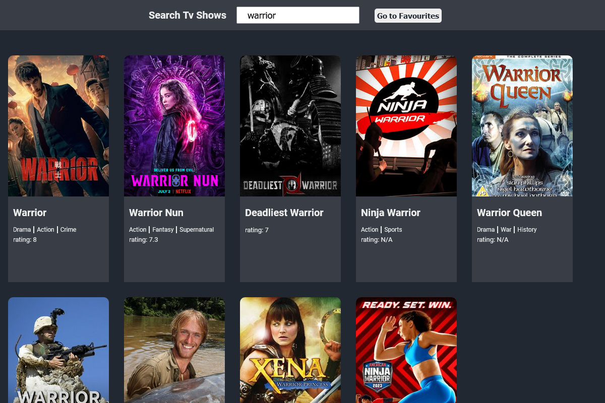
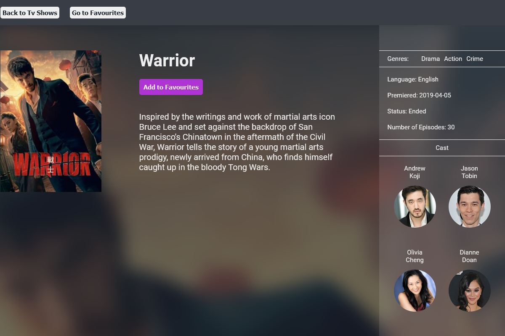

# TV DB

<a href="https://divano-tv-db.netlify.app/">
TV Show Database
</a>

 
This is a tv show database app I've made for practice. API used: <a href="https://www.tvmaze.com/api">www.tvmaze.com/api</a> 
Languages used in making of the app:

 

- HTML
- CSS
- JavaScript
- React

## App features:

- tv database search function
- single page for tv shows with more details
- link to the API's actors page
- favourites page with add/remove

## Screenshots

